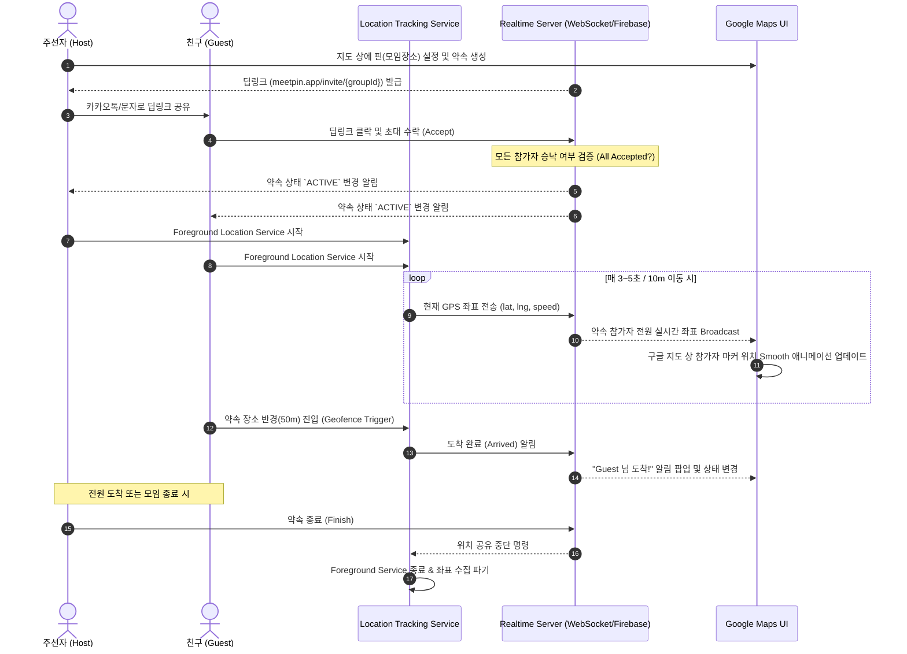

# 🏗️ 02. Architecture (시스템 & 앱 아키텍처 정의서)

> **⚠️ 구현 현황 — 「단일 기기 데모 / 백엔드 미구현」 단계 (2026-08-01 기준)**
> 이 문서는 목표 아키텍처(To-Be)입니다. 아래 기술 스택·시퀀스 다이어그램·위치 파이프라인 중 **서버 측(WebSocket/Firebase, Realtime Server, Broadcast)과 `:core:network` 계층은 아직 구현되지 않았습니다.** 현재는 인메모리 `FakeMeetPinRepository`가 서버 역할을 대신하는 단일 기기 데모입니다. 실제 구현 시 `MeetPinRepository` 인터페이스는 그대로 두고 `DataModule` 바인딩만 네트워크 구현체로 교체하도록 설계돼 있습니다.

## 1. 기술 스택 (Technology Stack)

### 1.1 Android Client
| 분류 | 기술 / 라이브러리 | 용도 |
| :--- | :--- | :--- |
| **언어** | Kotlin | 최신 객체지향 및 함수형 프로그래밍 언어 |
| **UI 프레임워크** | Jetpack Compose + Material 3 | 선언형 UI 구성 및 뷰 레이아웃 |
| **아키텍처** | Clean Architecture + MVVM / MVI | 계층 분리 (Data - Domain - Presentation) |
| **지도** | Google Maps SDK for Android + Maps Compose | 구글 지도 렌더링, 핀 마커 및 비동기 파이프라인 |
| **위치 서비스** | Google Play Services FusedLocationProviderClient | 효율적이고 정확한 GPS/Wi-Fi/기지국 기반 위치 수집 |
| **의존성 주입** | Hilt (Dagger-Hilt) | 의존성 주입 및 모듈화 |
| **비동기 / 스트림** | Kotlin Coroutines & Flow | 비동기 네트워크/DB 및 실시간 위치 좌표 데이터 스트림 |
| **네트워크** | Ktor Client / Retrofit2 + OkHttp WebSocket | REST API 및 실시간 WebSocket 소켓 통신 |
| **백그라운드 처리** | Android Foreground Service + WorkManager | 화면 꺼짐 상태에서도 유지되는 라이브 위치 공유 세션 |
| **딥링크** | Android App Links / Firebase Dynamic Links | 약속 초대 URL 파싱 및 앱 딥링크 연결 |

### 1.2 백엔드 & 실시간 서버 (Recommmended Options)
- **Option A (Firebase 기반 - 빠른 구축)**:
  - **Auth**: Firebase Anonymous / Kakao / Google Auth
  - **Database**: Firebase Realtime Database 또는 Cloud Firestore (실시간 온스냅샷 리스너)
  - **Push**: Firebase Cloud Messaging (FCM)
- **Option B (커스텀 WebSocket 백엔드 - 확장성 우수)**:
  - **Server**: Node.js (NestJS / Express) 또는 Kotlin Ktor / Go
  - **Realtime**: WebSocket Protocol (`ws://`) + Redis Pub/Sub
  - **Spatial DB**: PostgreSQL + PostGIS (지리 공간 검색 및 반경 계산)

---

## 2. 모바일 앱 계층 구조 (Clean Architecture)

```
app/
 ├── data/
 │    ├── datasource/         # Remote (WebSocket/Firebase), Local (Preferences/Room)
 │    ├── model/              # DTOs (LocationDto, MeetPinDto)
 │    └── repository/         # Repository Implementations
 ├── domain/
 │    ├── model/              # Domain Models (MeetPin, UserLocation, Participant)
 │    ├── repository/         # Repository Interfaces
 │    └── usecase/            # Business Logic (GetRealtimeLocationsUseCase, AcceptInviteUseCase)
 ├── service/
 │    └── LocationTrackingService.kt  # Foreground Service for Location Updates
 └── ui/
      ├── components/         # Common UI Components (MapMarker, StatusPill, UserAvatar)
      ├── create/             # Pin Creation & Search Screen
      ├── lobby/              # Waiting Room & Invite Status Screen
      ├── tracking/           # Live Map Tracking Screen
      └── theme/              # Color, Type, Shape (Material 3)
```

---

## 3. 실시간 위치 공유 서비스 흐름도 (Sequence Diagram)



---

## 4. 위치 추적 파이프라인 (Location Tracking Pipeline)

```
[FusedLocationProviderClient]
           │ (LocationResult - lat, lng, accuracy, timestamp)
           ▼
[LocationTrackingService (Foreground Service)]
           │ (Filtering: accuracy < 20m & Distance > 5m)
           ▼
[LocationRepository.sendLocation(location)]
           │ (WebSocket / Firebase Flow)
           ▼
[Realtime Server / Firebase]
           │ (Broadcast to Group)
           ▼
[TrackingViewModel (StateFlow)]
           │
           ▼
[GoogleMap (Compose) - Camera & Marker Interpolation]
```

### 위치 수집 관련 주요 Android 설정:
1. **Foreground Service Notification**: "MeetPin이 실시간 위치를 공유 중입니다." 알림을 영구 노출하여 사생활 침해 방지 및 Android OS에 의해 서비스가 종료되는 현상 방지.
2. **Battery Saver Mode 고려**: `LocationRequest.Builder` 사용 시 약속 장소와의 거리에 따라 `INTERVAL`을 가변 조절 (거리 5km 이상일 땐 10초, 500m 이내일 땐 3초).
